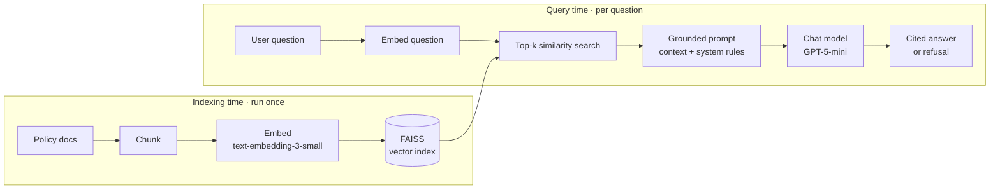

# Grounded RAG Assistant on Azure OpenAI

A retrieval-augmented generation (RAG) system that answers questions about a set
of organizational policy documents, grounding every response in the source text,
citing where each answer came from, and refusing to answer when the documents
don't cover the question. Built on Microsoft Foundry with keyless
authentication and an evaluation harness wired into CI.

> The document set in `knowledge/` is **synthetic** — fictional "State of
> Cascadia" policies created for this demo. No real or sensitive data is used.

## Why this exists

An unconstrained LLM will confidently answer a policy question with plausible
fiction. For government or regulated use that's unacceptable. This project
demonstrates the controls that make an LLM safe for that setting: grounding,
citation, refusal, evaluation, and data-classification discipline — the same
controls the sample AI Usage Policy (COT-GOV-007) in this repo requires.

## Architecture



The model is never fine-tuned on the documents. It stays general; the documents
live in a search index beside it, and relevant passages are retrieved and placed
in the prompt at question time. "Retrieval-augmented" means exactly that.

## Pipeline

| Stage | Script | Output |
|---|---|---|
| Ingest & chunk | `ingest.py` | `chunks.json` |
| Embed & index | `build_index.py` | `kb.faiss` |
| Retrieve & answer | `ask.py` | cited answer / refusal |
| Evaluate | `eval.py` | pass/fail score |

```bash
python ingest.py
python build_index.py
python ask.py "how long is standard email retained?"
python eval.py
```

## Responsible-AI controls

- **Grounding** — the system prompt instructs the model to answer only from
  retrieved context and never from outside knowledge.
- **Refusal** — when the context doesn't contain the answer, the model returns a
  fixed "I don't have that in the provided documents" instead of guessing. This
  is tested explicitly in the eval set.
- **Citation** — every factual claim carries the source chunk id, so any answer
  is traceable to a document.
- **Evaluation** — `eval.py` scores answers for both correctness and grounding
  against a fixed question set, and exits non-zero on any failure so regressions
  break the build.

## Data classification & residency

- Inputs are classified before ingestion (Public / Internal / Restricted /
  Confidential). Classification determines whether a document may be sent to a
  cloud model at all; Confidential content is excluded entirely. All documents in
  this demo are Public.
- Azure OpenAI keeps prompts and completions within the tenant and region and
  does not use them to train models.

## Security

Authentication is keyless. Locally the code authenticates as the developer's
Entra ID identity via `DefaultAzureCredential`; in CI it uses a GitHub OIDC
federated credential; in production the same code path picks up a workload's
managed identity. No API key or secret exists in source, configuration, or CI
secrets store.

## Model selection

- **Chat:** GPT-5-mini — sufficient reasoning for grounded Q&A at low cost and
  latency. Upgrade to a larger model only if evaluation shows it's needed.
- **Embeddings:** text-embedding-3-small (1536 dimensions) — strong
  cost-to-quality ratio for retrieval.